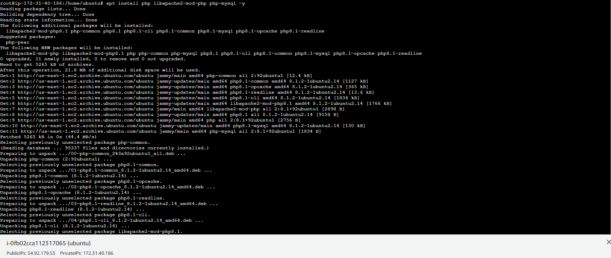
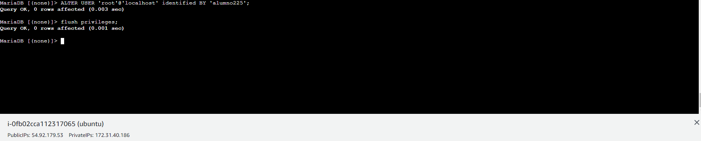

# actividad13_lamp
## Ander Pelayo Remesal

Lo primero que tendremos que hacer es ver la version de apache que tenemos instalado en la maquina.   
Para ello usamo el comando `apache2 -v`

   

El siguiente paso que realizaremos para unstalr el LAMP tendremos que instalar el PHP, para esto el comando que tenemos que ejecutar
es el siguiente `apt install php libapache2-mod-php php-mysql -y` .   
Con esto ya tendriamos instaldo 3 cosas de las 4 necesarias en el LAMP.   

   

Ahora vamos a modificar el archivo de configuacion el cual se encuentra en la ruta `/etx/apache2/sites-available`   

   

   

Posteriormente lo que haremos sera crear un documento `info.php` , que estara situdado en el directorio `/var/www/html` .   
En este archivo lo uno que haremos es meter una linea de codigo por lo que con un `echo` lo podriamos crear sin tener ningun problema.   

   

Hecho este paso la paguna de PHP de nuestro servidor Linux nos quedaria de la siguiente manera.   

   

Por ultimo lo que tendremos que instalar es nuestra base de datos, en nuestro caso no sera MySQL, si no que instalariamos otro gestor de 
bases de datos que sera MariaDB.   
Para instalar este paquete la instruccion que tendremos que ejecutar es `apt install -y mariadb-server mariadb-client`   

   

Lo siguiente que tendremos que hacer es entrar en la base de datos, para ello usamos el comando `mariadb -u root` , con este comando lo que 
hacemos es entrar en la base de datos como root.   

   

Ahora crearemos el usuario dentro de la base de datos.   

   

Finalmente instalaremos el PHPmyadmin, para ello usamos la siguiente instruccion `apt install phpmyadmin php-mbstring php-zip php-gd php-json php-curl -y` con esto terminariamos las instalaciones de paquetes, lo qunico que nos quedaria es configurarlo.   

   

En los siguientes pasos seran la configuracion del PHPmyadmin   

   

   

   

Finalizada esta configuracion que hemos visto en las 3 capturas anteriores lo que tendremos que hacer es ir al navegador y escribir la ip siguido de phpmyadmin como vemos en la siguiente imagen   

   

Finalmente al introducir en usuario y contraseña nos introducira dentro del gestor de la base de datos.   

   

Comprobaciones:   

   

   
